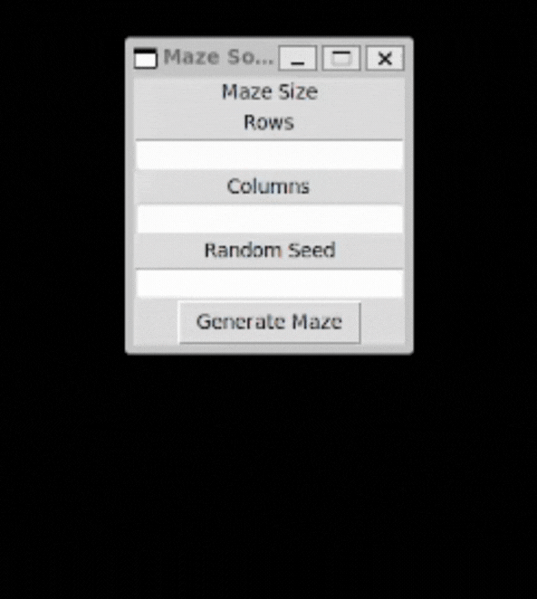
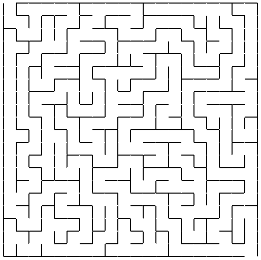
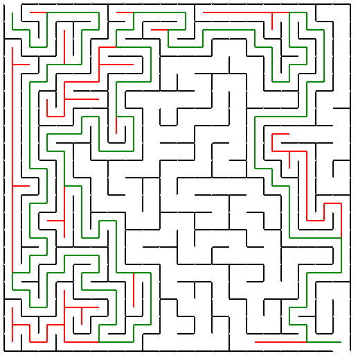
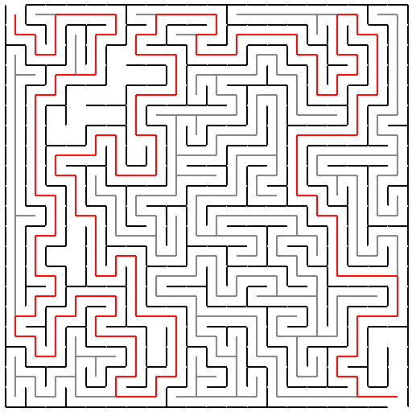

# 🧩 Maze Solver Visualizer

A Python application built with **Tkinter** that generates a random maze and visualizes the pathfinding process using **Breadth-First Search (BFS)** and **Depth-First Search (DFS)**.

 <!-- Optional: Insert a GIF of the animation -->

---

## 📌 Features

-  🔀 Random maze generation with customizable size
-  🧱 Wall rendering and path carving
-  👣 Visualized BFS traversal through the maze
-  📍 Animated solution path for both DFS and BFS
-  🧪 Unit-tested maze creation logic

---

## 🚀 Getting Started

### 📦 Requirements

-  Python 3.7+
-  No external libraries needed (only `tkinter` and `collections`)

### 📥 Installation

Clone the repo:

```bash
git clone https://github.com/JerryShum/maze-builder-solver.git
cd maze-solver-visualizer
```

Run the app:

```bash
python main.py
or
./main.sh
```

---

## ⚙️ How It Works

### 1. Maze Generation

-  The maze is represented as a 2D grid of `Cell` objects.
-  Walls exist between adjacent cells, and the maze is carved using **BFS** or **DFS**.

### 2. Maze Solving

-  A `solve_bfs(start_row, start_col)` function explores neighbors using a queue.
    -  Parents are tracked for backtracking and final path reconstruction.
    -  The solution path is visualized using colored lines.


-  A `solve_dfs(start_row, start_col)` function explores neighbors using a recursive approach.
    -  The recursive approach is used to avoid keeping track of parents.
    -  Backracking is supported and occurs whenever the algorithm encounters a dead-end.
    -  The solution path is visualized using colored lines.

### 3. Animation

-  The `__animate()` method adds a slight delay using `time.sleep` to simulate traversal.
-  `draw_move()` renders each movement visually on the canvas.

---

## 📚 Code Structure

```
├── main.py              # Launches the application
├── window.py            # Tkinter window and canvas logic
├── maze.py              # Maze generation and solving logic
├── cell.py              # Representation of each grid cell
└── tests.py             # Unit tests for maze creation
```

---

## 💡 What I Learned

-  Fundamentals of GUI programming with Tkinter
-  BFS and DFS algorithm and path reconstruction
-  Object-oriented programming (OOP) in Python
-  Visual debugging through animation
-  Clean and modular code structure

---

## 📸 Screenshots

<table>
    <tr>
      <td><strong>Maze Generated</strong></td>
      <td><strong>BFS Traversal</strong></td>
      <td><strong>DFS Traversal</strong></td>
    </tr>
    <tr>
      <td></td>
      <td></td>
      <td></td>
    </tr>
  </table>

---

## 📜 License

MIT License © 2025 \[Jerry Shum]
